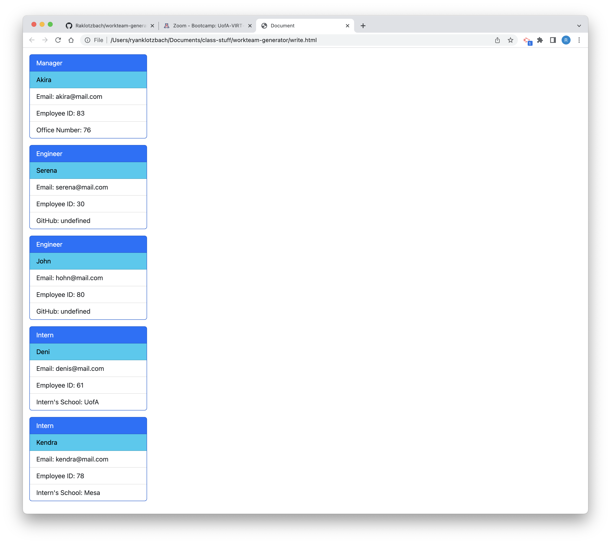

# workteam-generator

# Description:
- Team generator that allows the user to build a workteam by entering in details about the team's manager, engineers, and interns.  Once all information is collected and team is built, a html document will be created with individual cards for each member of the team.

#Link:

* https://raklotzbach.github.io/workteam-generator/

# Screenshot:

# Video Link:

* https://drive.google.com/file/d/1qADzvouuFyVorDTPWKvssluM8SlLv0VX/view

